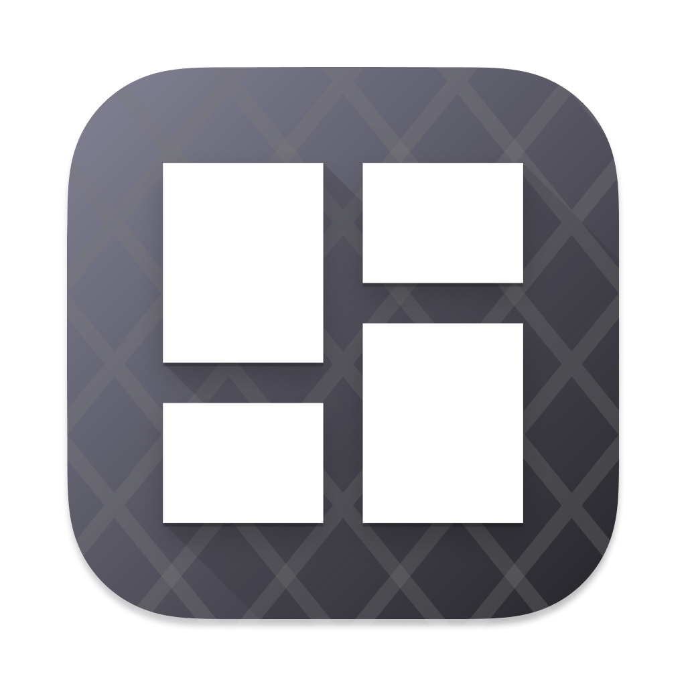
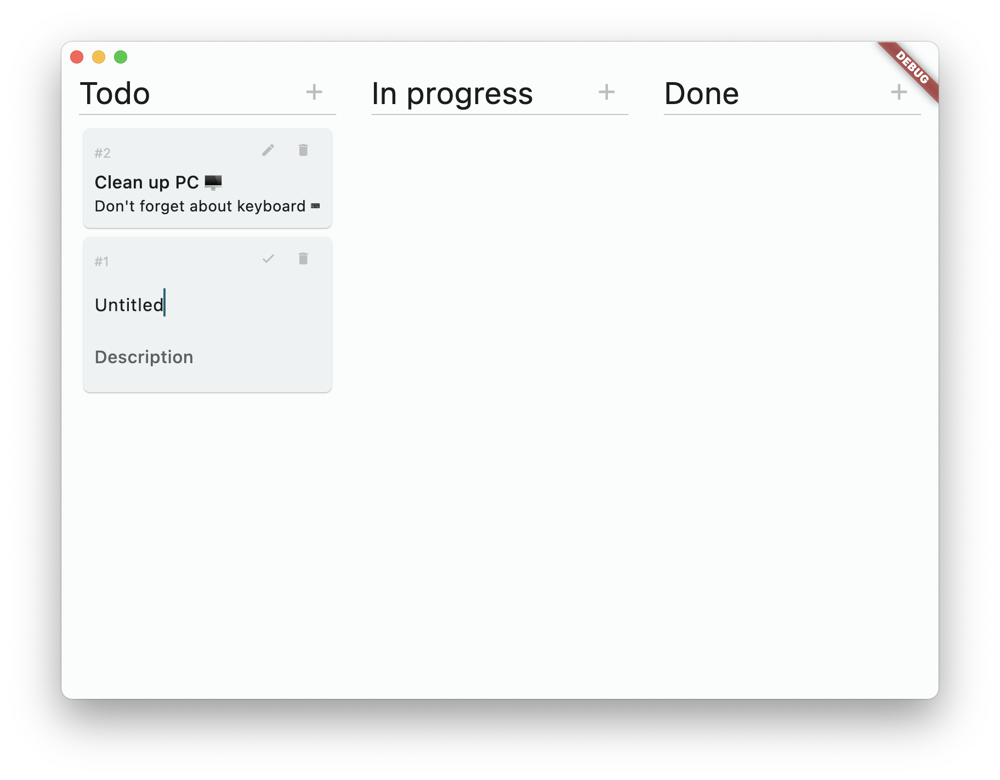

#  Kanban

Experimental desktop Flutter app to see what's is possible.

**Features**
- drag'n drop between columns
- sqlite for persistence
- cards edit/delete

## Development

App is target to be run on desktop environments.

To install dependencies run `flutter pub get`.\
Using VSCode, launch debugger and that's it.
